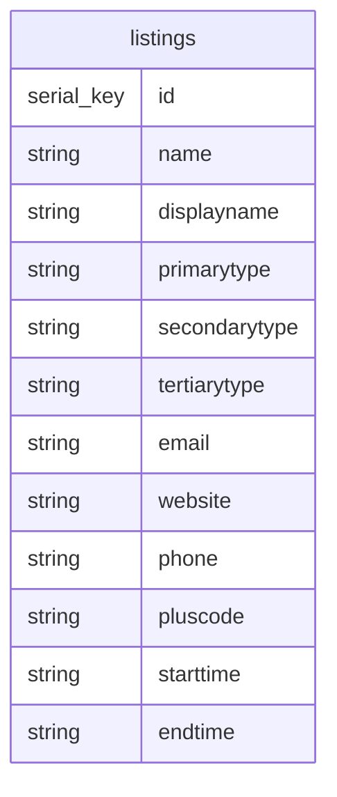

# Mill Road Winter Fair App Database & API
The centralised database and API for the Mill Road Winter Fair App

## Purpose

### Potential Future Development Ideas

## Setting Up Your Local Environment

### Prerequisites

**1. Install PostgreSQL Locally:**
- macOS: Use Homebrew:
```shell
brew install postgresql
brew services start postgresql
```

- Ubuntu: Use APT:
```shell
sudo apt update
sudo apt install postgresql postgresql-contrib
sudo systemctl start postgresql
```

- Windows: Download and install PostgreSQL from the official [website](https://www.postgresql.org/download/).

Once installed, log in as the postgres user:

```shell
sudo -u postgres psql
```

**2. Create a database and user:**
```sql
CREATE DATABASE barberqueue_db;
CREATE USER mrwfadmin WITH ENCRYPTED PASSWORD 'petersfield';
GRANT ALL PRIVILEGES ON DATABASE barberqueue_db TO admin;
```

**3. In the respository, install the PostgreSQL driver:**
```shell
go get -u github.com/lib/pq
```

**4. Create the schema in the `mrwf_db` (I used the VSCode Postgre plugin for running queries like this.):**

```postgresql
CREATE TABLE listings (
    id SERIAL PRIMARY KEY,
    name VARCHAR(100),
	displayname VARCHAR(100),
	primarytype VARCHAR(100),
	secondarytype VARCHAR(100),
	tertiarytype VARCHAR(100),
	email VARCHAR(100),
	website VARCHAR(100),
	phone VARCHAR(12),
	pluscode VARCHAR(15),
	starttime VARCHAR(5),
	endtime VARCHAR(5)
);
```

**5. You should now be able to run the db & API locally.**

## Helper Scripts
You can find the following helper scripts in `/helperScripts`:

| Name                         | Descriptionn                                                  | Execution                      |
| ---------------------------- | ------------------------------------------------------------- | ------------------------------ |
| Add Testing Data To Local DB | Adds a number of example listings for testing purposes.       | `./addTestingDataToLocalDB.sh` |
| Wipe Local DB                | Wipes all data from the local DB. Leaves the schema in place. | `./wipeLocalDB.sh`             |

## DB Schema
Below is a graphical representation of the current database schema:



## Postman API Documentation

Example API use cases can be found on Postman, [here](https://orange-crater-235389.postman.co/workspace/Mill-Road-Winter-Fair-App-API~2f3cf4fe-aa38-46a2-bd71-d2b5fa5e76fb/overview).

## Other Links
- Mill Road Winter Fair App: https://github.com/MarauderOne/mill_road_winter_fair_app
